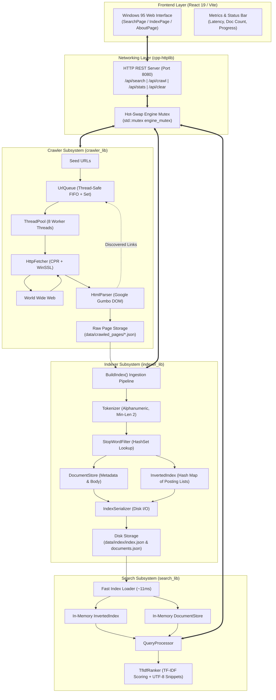
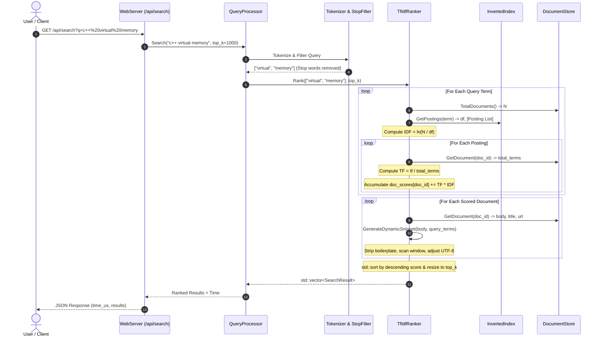

# search++ — Technical Deep Dive & System Documentation


> **Project Name:** search++  
> **Language & Standard:** C++17, JavaScript (React 19)  
> **Primary Purpose:** Full-stack, in-memory web search engine with multi-threaded crawling, inverted indexing, TF-IDF ranking, REST API server, and a retro Windows 95 frontend.  

---

## 1. Project Overview

**search++** is an end-to-end, multi-threaded web search engine written in modern C++ (C++17) with a dedicated web frontend built with React and Vite. It provides a complete information retrieval pipeline spanning automated web crawling, HTML content extraction, lexical text analysis, inverted index construction, disk serialization, TF-IDF relevance ranking, and low-latency query processing exposed over a REST API.

The system was engineered to explore the core algorithms, concurrent synchronization mechanisms, and data structures powering information retrieval systems from first principles. It demonstrates how low-level systems programming in C++ can achieve microsecond search latencies across crawled web corpora without relying on heavyweight external search frameworks like Lucene or Elasticsearch.

### What the Project Currently Supports
* **Multi-threaded Web Crawling:** Concurrent HTTP/HTTPS crawling with thread pooling, URL frontier management, cycle prevention, path normalization, and domain link resolution.
* **DOM Text Extraction:** HTML5 parsing using Google's Gumbo parser, stripping non-content tags (`<script>`, `<style>`, `<noscript>`, `<head>`) and extracting clean page text and titles.
* **Lexical Processing:** Tokenization, alphanumeric filtering, lowercasing, minimum-length thresholding, and hash-set stop word elimination.
* **In-Memory Inverted Indexing:** Term-to-posting-list index with document-level term frequencies and fast vector lookups.
* **Persistent Index Serialization:** JSON-based index and document metadata serialization to disk, reducing engine startup from hundreds of milliseconds to ~11 milliseconds.
* **TF-IDF Relevance Scoring:** Length-normalized Term Frequency (TF) combined with natural logarithmic Inverse Document Frequency (IDF) for ranking multi-term queries.
* **Dynamic Snippet Generation with UTF-8 Boundary Protection:** Contextual snippet generation centered on matching query terms, highlighting matches in `<mark>` tags while safeguarding against multi-byte UTF-8 character splitting.
* **Thread-Safe Hot Swapping:** Dynamic atomic index reloading in the HTTP server upon crawl completion without blocking ongoing search requests.
* **Full-Featured Web GUI:** Windows 95 retro-themed single-page application with real-time crawling progress, metrics dashboard, pagination, and database management.

---

## 2. Project at a Glance

| Attribute | Implementation Details |
| :--- | :--- |
| **Language & Standard** | C++17 (MSVC / GCC / Clang compatible) |
| **Build System** | CMake (v3.20+) with `FetchContent` automated dependency management |
| **Concurrency Model** | Worker Thread Pool (`std::thread`, `std::condition_variable`, `std::future`), Thread-Safe Queue |
| **HTTP Client (Crawler)** | CPR (C++ Requests v1.11.1) backed by Windows WinSSL / libcurl |
| **HTML Parser** | Google Gumbo Parser (v0.10.1, pure C99 HTML5 parser) |
| **Data Interchange & JSON** | nlohmann/json (v3.11.3) |
| **Backend Web Server** | cpp-httplib (v0.15.3, multi-threaded embedded HTTP server) |
| **Index Architecture** | In-Memory Inverted Index (`std::unordered_map<std::string, std::vector<Posting>>`) |
| **Scoring Algorithm** | Normalized TF $\times$ Logarithmic IDF ($\sum \text{TF} \times \text{IDF}$) |
| **Disk Persistence** | Dual JSON flat-files (`index.json` and `documents.json`) |
| **Frontend Stack** | React 19, Vite 8, `retro-react`, Emotion CSS, W95FA Pixel Typography |
| **API Protocol** | JSON over HTTP REST (`/api/search`, `/api/crawl`, `/api/stats`, `/api/clear`) |

---

## 3. High-Level Architecture

The search++ engine operates across three distinct operational layers:
1. **Ingestion & Indexing Pipeline (Data Inflow):** Multi-threaded crawler fetches raw HTML, parses DOM structures, extracts text, tokenizes, filters stop words, maps postings, and persists index files to disk.
2. **Core Search & Ranking Engine (Query Flow):** Reads pre-built index files into RAM, tokenizes raw user queries, computes term weights, scores matching candidate documents using TF-IDF, generates dynamic UTF-8 snippets, and ranks top-$K$ hits.
3. **Serving & Presentation Layer (User Interface):** An embedded `cpp-httplib` server serves both the REST API endpoints and compiled static frontend assets, communicating with a retro Windows 95-themed React UI.

### System Architecture Diagram



---

## 4. System Components

The project codebase is partitioned into four modular static libraries and a root command-line executable:

```
search-engine/
├── CMakeLists.txt                 # Root build definition & compiler flags
├── cmake/
│   └── FetchDependencies.cmake    # CMake FetchContent configuration
├── src/
│   ├── main.cpp                   # Unified CLI entry point & server orchestrator
│   ├── crawler/                   # Subsystem: crawler_lib
│   │   ├── crawler.h / .cpp       # Crawl coordinator and file persistence
│   │   ├── html_parser.h / .cpp   # Gumbo DOM extraction and URL resolution
│   │   ├── http_fetcher.h / .cpp  # CPR HTTP client wrapper
│   │   ├── thread_pool.h / .cpp   # Generic multi-threaded worker pool
│   │   └── url_queue.h / .cpp     # Thread-safe synchronized URL queue
│   ├── indexer/                   # Subsystem: indexer_lib
│   │   ├── document_store.h / .cpp# Document metadata and raw text store
│   │   ├── index_serializer.h/.cpp# JSON serialization & deserialization engine
│   │   ├── inverted_index.h / .cpp# Core hash-map inverted index data structure
│   │   ├── stop_words.h / .cpp    # Stop word hash filter (file & default list)
│   │   └── tokenizer.h / .cpp     # String parser and lowercase token generator
│   ├── search/                    # Subsystem: search_lib
│   │   ├── query_processor.h/.cpp # High-level query orchestration pipeline
│   │   └── tf_idf_ranker.h / .cpp # TF-IDF scoring and dynamic snippet highlighter
│   └── server/                    # Subsystem: server_lib
│       ├── web_server.h / .cpp    # cpp-httplib REST API and static route handlers
├── frontend/                      # Vite + React 19 Frontend Web Application
│   ├── src/                       # React components and styling
│   └── package.json               # NPM dependency definitions
└── data/                          # Runtime data directory
    ├── crawled_pages/             # Individual raw crawled JSON documents
    ├── index/                     # Serialized index.json & documents.json
    └── stop_words.txt             # Extended 274-word stop list
```

---

## 5. Indexing Engine

### 5.1 Document Ingestion
Documents enter the indexing engine through two primary pathways:
1. **Batch CLI Ingestion (`BuildIndex()` in `src/main.cpp`):** Reads all `.json` files from `./data/crawled_pages/`, sorts filenames alphabetically to maintain stable document order, and parses each JSON document using `nlohmann::json`.
2. **Dynamic Ingestion (Triggered by `/api/crawl`):** Upon background crawl completion, the server invokes `BuildIndex()` directly on the crawl directory and initiates in-memory index hot-swapping.

Each raw input file contains:
```json
{
    "doc_id": 0,
    "url": "https://en.wikipedia.org/wiki/C++",
    "title": "C++ - Wikipedia",
    "body": "C++ is a high-level, general-purpose programming language..."
}
```

### 5.2 Document Representation
Document metadata is managed in `src/indexer/document_store.h` via the `DocumentInfo` struct:

```cpp
struct DocumentInfo {
    int doc_id = -1;
    std::string url;
    std::string title;
    std::string body;        // Full body text for dynamic snippets
    int total_terms = 0;     // Total number of terms after tokenization (for TF calculation)
};
```

The `DocumentStore` class encapsulates a contiguous `std::vector<DocumentInfo>` and an auto-incrementing `next_id_` counter. Document retrieval by integer ID is an $O(1)$ array indexing operation:

```cpp
int DocumentStore::AddDocument(const std::string& url, const std::string& title,
                               const std::string& body_text, int total_terms) {
    int doc_id = next_id_++;
    DocumentInfo info;
    info.doc_id = doc_id;
    info.url = url;
    info.title = title;
    info.body = body_text;
    info.total_terms = total_terms;
    
    documents_.push_back(info);
    return doc_id;
}
```

### 5.3 Text Extraction
HTML parsing and text extraction are handled by `HtmlParser` (`src/crawler/html_parser.cpp`) using the C-based Google Gumbo parser:
* **DOM Tree Construction:** Calls `gumbo_parse(html.c_str())`.
* **Title Extraction:** Performs a recursive search on `GumboNode` for `GUMBO_TAG_TITLE` and reads the first text child.
* **Body Text Extraction:** Recursively walks DOM elements. If a node has type `GUMBO_NODE_TEXT`, its text is appended to the body string. If a node is a `<script>`, `<style>`, `<noscript>`, or `<head>` element, the entire subtree is ignored.
* **Link Discovery & Resolution:** Iterates over `GUMBO_TAG_A` elements, reads `href` attributes, resolves relative paths against the base URL via `ResolveUrl()`, strips URL fragments (`#...`), and normalizes trailing slashes.

### 5.4 Tokenization
Tokenization is implemented in `Tokenizer` (`src/indexer/tokenizer.cpp`):
* The input text is first lowercased using `std::transform` with `::tolower`.
* The tokenizer performs a single sequential character scan across the text.
* Characters satisfying `std::isalnum` are appended to an accumulator string `current_token`.
* Non-alphanumeric characters act as delimiters.
* Only tokens with length $\ge 2$ (`kMinTokenLength = 2`) are emitted to prevent single-character indexing noise.

```cpp
std::vector<std::string> Tokenizer::Tokenize(const std::string& text) const {
    std::string lower_text = ToLowerCase(text);
    std::vector<std::string> tokens;
    std::string current_token;

    for (char c : lower_text) {
        if (IsAlphanumeric(c)) {
            current_token += c;
        } else {
            if (current_token.length() >= kMinTokenLength) {
                tokens.push_back(current_token);
            }
            current_token.clear();
        }
    }
    if (current_token.length() >= kMinTokenLength) {
        tokens.push_back(current_token);
    }
    return tokens;
}
```

### 5.5 Normalization & Filtering
* **Lowercasing:** Conducted globally during tokenization.
* **Punctuation Removal:** Stripped implicitly by treating all non-alphanumeric ASCII characters as token boundaries.
* **Stop-Word Removal:** Implemented by `StopWordFilter` (`src/indexer/stop_words.cpp`). It maintains an `std::unordered_set<std::string>`. If `data/stop_words.txt` exists, it loads 274 stop words; otherwise, it falls back to a hardcoded 64-word English list.
* **Stemming / Lemmatization:** *Not implemented in the current codebase.* Terms are indexed in their raw tokenized form.

### 5.6 Inverted Index Data Structure
The core index is implemented in `InvertedIndex` (`src/indexer/inverted_index.h`):

```cpp
struct Posting {
    int doc_id;
    int term_frequency;  // How many times this term appears in this document
};

class InvertedIndex {
private:
    std::unordered_map<std::string, std::vector<Posting>> index_;
    size_t doc_count_ = 0;
    static const std::vector<Posting> kEmptyPostings;
};
```

When a document is indexed:
1. Term counts within the document are aggregated using a local map: `std::unordered_map<std::string, int> term_counts`.
2. For each unique term, a `Posting{doc_id, count}` struct is pushed into `index_[term]`.
3. `doc_count_` is incremented.

```
┌─────────────┐       ┌────────────────────────────────────────────────────────┐
│    Term     │  ──►  │ Posting List: std::vector<Posting>                     │
├─────────────┤       ├────────────────────────────────────────────────────────┤
│ "compiler"  │  ──►  │ [DocID: 0, TF: 14] ──► [DocID: 12, TF: 3] ──► ...      │
│ "algorithm" │  ──►  │ [DocID: 2, TF: 5]  ──► [DocID: 7,  TF: 1] ──► ...      │
│ "thread"    │  ──►  │ [DocID: 0, TF: 2]  ──► [DocID: 4,  TF: 8] ──► ...      │
└─────────────┘       └────────────────────────────────────────────────────────┘
```

### 5.7 Index Persistence & Fast Startup
Index persistence is implemented in `IndexSerializer` (`src/indexer/index_serializer.cpp`). It serializes the in-memory structures into two separate JSON files in `./data/index/`:

1. **`index.json`:** Stores overall term/doc counts and the postings map:
```json
{
  "doc_count": 100,
  "term_count": 12450,
  "terms": {
    "algorithm": [
      {"d": 0, "f": 4},
      {"d": 5, "f": 12}
    ]
  }
}
```
2. **`documents.json`:** Stores document metadata:
```json
{
  "total": 100,
  "documents": [
    {
      "id": 0,
      "url": "https://en.wikipedia.org/wiki/C++",
      "title": "C++ - Wikipedia",
      "body": "...",
      "total_terms": 2184
    }
  ]
}
```

#### Index Inversion During Deserialization
When loading `index.json`, `LoadIndex()` reconstructs documents by transposing the inverted postings map back into per-document token lists (`std::unordered_map<int, std::vector<std::string>> doc_tokens`), sorting the document IDs, and sequentially inserting them via `index.AddDocument()`. This ensures internal document count consistency while loading from disk in approximately **11 ms**.

> 🎥 **[INDEXING DEMO VIDEO — ADD HERE]**

---

## 6. Search Engine & Ranking

### 6.1 Search Lifecycle Diagram



### 6.2 Query Processing Pipeline
When a query string is submitted to `QueryProcessor::Search()` (`src/search/query_processor.cpp`):
1. **Raw String Input:** e.g., `"The C++ memory allocator"`.
2. **Tokenization:** Broken down into lowercase alphanumeric tokens: `["the", "memory", "allocator"]`.
3. **Stop-Word Filtering:** Common stop words (`"the"`) are eliminated, yielding: `["memory", "allocator"]`.
4. **Empty Check:** If no valid terms remain, search terminates immediately and returns `{}`.

### 6.3 Scoring Algorithm (TF-IDF Formulation)
The relevance ranker is implemented in `TfIdfRanker` (`src/search/tf_idf_ranker.cpp`).

#### 1. Term Frequency (Normalized TF)
To prevent long documents from dominating results merely due to higher raw word counts, Term Frequency is normalized by the total number of filtered terms in the document:

$$\text{TF}(t, d) = \frac{\text{count}(t, d)}{L_d}$$

Where:
* $\text{count}(t, d)$ is `posting.term_frequency` (occurrences of term $t$ in document $d$).
* $L_d$ is `doc_info.total_terms` (total tokens in document $d$).

#### 2. Inverse Document Frequency (Logarithmic IDF)
Inverse Document Frequency measures how rare a term is across the entire corpus:

$$\text{IDF}(t) = \ln\left(\frac{N}{\text{df}(t)}\right)$$

Where:
* $N$ is the total document count in `DocumentStore` (`doc_store_.TotalDocuments()`).
* $\text{df}(t)$ is the document frequency (`index_.GetPostings(term).size()`).
* If $\text{df}(t) == 0$, $\text{IDF}(t) = 0.0$.

#### 3. Composite Document Relevance Score
For a multi-term query $Q = \{t_1, t_2, \dots, t_m\}$, the overall score for document $d$ is:

$$\text{Score}(d, Q) = \sum_{t \in Q} \text{TF}(t, d) \times \text{IDF}(t)$$

### 6.4 Dynamic Snippet Generation & UTF-8 Boundary Preservation
`GenerateDynamicSnippet()` (`src/search/tf_idf_ranker.cpp`) builds contextual previews:
1. **Wikipedia Boilerplate Stripping:** Detects and strips common Wikipedia navigation headers (e.g., `"Jump to content Main menu..."`).
2. **Term Matching:** Identifies the earliest occurrence of any query term in the body text.
3. **Window Extraction:** Slices a window of 80 characters before and after the match (`window_size = 80`).
4. **UTF-8 Multi-Byte Character Boundary Correction:** In UTF-8, continuation bytes begin with bit pattern `10xxxxxx` (`(byte & 0xC0) == 0x80`). Slicing arbitrary byte offsets can bisect a multi-byte sequence, causing garbled characters or crashes. The engine steps backward on the start index and forward on the end index until reaching valid UTF-8 lead bytes:

```cpp
// Adjust start to a valid UTF-8 character boundary (not a continuation byte 10xxxxxx)
while (start > 0 && start < body.size() && (body[start] & 0xC0) == 0x80) {
    start--;
}

// Adjust end to a valid UTF-8 character boundary
size_t end = start + std::min(length, body.size() - start);
while (end < body.size() && (body[end] & 0xC0) == 0x80) {
    end++;
}
```

5. **HTML Highlight Marking:** Scans the snippet and replaces matching query words with `<mark>term</mark>` for browser rendering.

### 6.5 Ranking & Top-$K$ Selection
* Matching documents are accumulated in `std::unordered_map<int, double> doc_scores`.
* All matching documents are converted into `SearchResult` structs inside a `std::vector<SearchResult>`.
* Results are sorted using `std::sort` with a lambda comparator `[](const SearchResult& a, const SearchResult& b) { return a.score > b.score; }`.
* If `results.size() > top_k`, the vector is truncated via `results.resize(top_k)`.

> 🎥 **[SEARCH DEMO VIDEO — ADD HERE]**

---

## 7. Data Structures Deep Dive

| Data Structure | Code Location | Container / Type | Primary Purpose | Average Complexity | Justification & Alternatives |
| :--- | :--- | :--- | :--- | :--- | :--- |
| **Inverted Index Map** | `InvertedIndex::index_` | `std::unordered_map<std::string, std::vector<Posting>>` | Maps lexicon terms to their document posting lists. | Lookup: $O(1)$<br/>Insert: $O(1)$ | Hash map provides constant-time lookup required during fast query term evaluation. *Alternative: Trie or B-Tree (better prefix matching, but higher cache overhead and $O(k)$ lookup).* |
| **Posting List** | `InvertedIndex::Posting` | `std::vector<Posting>` | Stores `(doc_id, term_frequency)` tuples for a term. | Append: $O(1)$<br/>Scan: $O(P)$ | Contiguous dynamic array maximizes CPU cache locality during scoring iteration. *Alternative: `std::list` (avoids reallocations, but severe pointer-chasing cache penalties).* |
| **Document Store** | `DocumentStore::documents_` | `std::vector<DocumentInfo>` | Stores document metadata, full body text, and total term count. | Access: $O(1)$<br/>Insert: $O(1)$ | Direct indexing by `doc_id` provides instant retrieval without hashing overhead. *Alternative: Disk-based SQLite or RocksDB (necessary for millions of pages, but slower than RAM vector).* |
| **URL Visited Set** | `UrlQueue::visited_` | `std::unordered_set<std::string>` | Tracks visited/enqueued URLs to prevent crawl cycles. | Lookup: $O(1)$<br/>Insert: $O(1)$ | Hash set provides deduplication before pushing to FIFO queue. *Alternative: Bloom Filter (space efficient, but false positives discard valid pages).* |
| **URL Frontier Queue** | `UrlQueue::queue_` | `std::queue<std::string>` | Synchronized FIFO queue for breadth-first web crawling. | Push: $O(1)$<br/>Pop: $O(1)$ | Standard FIFO guarantees Breadth-First Search (BFS) crawl ordering. *Alternative: Priority queue (for PageRank/OPIC prioritized crawling).* |
| **Thread Task Queue** | `ThreadPool::tasks_` | `std::queue<std::function<void()>>` | Holds pending asynchronous tasks for worker threads. | Push: $O(1)$<br/>Pop: $O(1)$ | Simple FIFO queue coordinates task distribution among worker threads. |
| **Score Accumulator** | `TfIdfRanker::Rank()` | `std::unordered_map<int, double>` | Accumulates TF-IDF scores per candidate `doc_id`. | Insert/Update: $O(1)$ | Fast accumulator for multi-term query disjunctions. |
| **Stop Word Filter** | `StopWordFilter::stop_words_` | `std::unordered_set<std::string>` | In-memory lexicon of excluded grammatical noise words. | Lookup: $O(1)$ | Constant-time set membership test during token filtering. |

---

## 8. Algorithms

### 8.1 Multi-Threaded Breadth-First Crawling
* **Location:** `src/crawler/crawler.cpp` and `src/crawler/url_queue.cpp`
* **Algorithm:** Synchronized BFS over the web graph.
* **Mechanism:** 
  1. Master seeds are pushed to `UrlQueue`.
  2. $N$ worker threads pop URLs from `UrlQueue` (blocking on `std::condition_variable` when empty).
  3. Worker fetches page via CPR, parses links via Gumbo, assigns atomic document ID via `next_doc_id_.fetch_add(1)`, writes JSON to disk, and pushes new HTTP/HTTPS URLs back into `UrlQueue`.
  4. Deduplication is enforced atomically inside `UrlQueue::Push()` via `visited_.insert(url)`.

### 8.2 Token Extraction & Cleaning
* **Location:** `src/indexer/tokenizer.cpp`
* **Algorithm:** Single-pass character classification and state buffer accumulation.
* **Mechanism:** Iterates across characters in $O(N)$ time. Uses `std::isalnum` to build tokens and ignores delimiter characters. Rejects tokens shorter than 2 characters.

### 8.3 Inverted Index Construction
* **Location:** `src/indexer/inverted_index.cpp`
* **Algorithm:** In-memory term frequency map aggregation followed by posting list insertion.
* **Mechanism:** For each document, counts intra-document term frequencies in $O(T)$ where $T$ is token count, then appends postings to the master dictionary in $O(U)$ where $U$ is unique tokens.

### 8.4 Logarithmic TF-IDF Scoring
* **Location:** `src/search/tf_idf_ranker.cpp`
* **Algorithm:** Vector space term-document relevance scoring.
* **Mechanism:** Computes $\text{IDF} = \ln(N / \text{df})$ for each query term, iterates through each term's posting list, computes document-normalized $\text{TF} = \text{tf} / L_d$, and sums $\text{TF} \times \text{IDF}$ into an accumulator map.

### 8.5 Snippet Window Selection & UTF-8 Character Slicing
* **Location:** `src/search/tf_idf_ranker.cpp`
* **Algorithm:** Contextual substring window slicing with bitwise UTF-8 continuation byte correction.
* **Mechanism:** Locates query term in body, offsets $\pm 80$ characters, decrements start byte if bitmask `(byte & 0xC0) == 0x80`, increments end byte if bitmask matches, and wraps matches in `<mark>` tags.

---

## 9. Complexity Analysis

| Operation | Time Complexity (Average) | Time Complexity (Worst-Case) | Space Complexity | Notes / Bottlenecks |
| :--- | :--- | :--- | :--- | :--- |
| **Tokenize String ($M$ chars)** | $O(M)$ | $O(M)$ | $O(M)$ | Single sequential character scan; allocates token vector. |
| **Stop Word Check ($K$ tokens)** | $O(K)$ | $O(K)$ | $O(K)$ | $O(1)$ average hash-set lookup per token. |
| **Add Document ($K$ tokens)** | $O(K)$ | $O(K)$ | $O(K)$ | Hash map accumulation + posting list push. |
| **Lookup Postings ($T$ terms)** | $O(T)$ | $O(T \times \text{BucketLen})$ | $O(1)$ | Hash map lookup returns const reference. |
| **TF-IDF Scoring ($T$ terms, $P$ total postings)** | $O(T + P)$ | $O(T + P)$ | $O(\text{Unique Matching Docs})$ | Iterates exactly over postings of query terms. |
| **Ranking Top-$K$ ($D$ candidate docs)** | $O(D \log D)$ | $O(D \log D)$ | $O(D)$ | `std::sort` across matching document vector. |
| **Snippet Generation ($B$ chars in body)** | $O(B)$ | $O(B)$ | $O(\text{Window Size})$ | Substring search + window slice + UTF-8 byte scan. |
| **Index Serialization ($N$ docs, $V$ vocab)** | $O(N + \sum \text{Postings})$ | $O(N + \sum \text{Postings})$ | $O(\text{File Size})$ | JSON stringification and disk write. |
| **Index Deserialization** | $O(\sum \text{Postings} + N \log N)$ | $O(\sum \text{Postings} + N \log N)$ | $O(\text{Index Size in RAM})$ | Parses JSON, groups by doc ID, sorts, and inserts into index. |

---

## 10. Concurrency & Multithreading

The search++ engine utilizes multi-threading in both the crawler and the web server subsystems:

```
                  ┌─────────────────────────────────────────────────────────┐
                  │                 Crawler ThreadPool                      │
                  │  ┌───────────┐  ┌───────────┐        ┌───────────┐      │
                  │  │ Worker 1  │  │ Worker 2  │  ...   │ Worker 8  │      │
                  └──┴─────┬─────┴──┴─────┬─────┴────────┴─────┬─────┴──────┘
                           │              │                    │
                           ▼              ▼                    ▼
                  ┌─────────────────────────────────────────────────────────┐
                  │          UrlQueue (Thread-Safe Synchronization)         │
                  │   - std::mutex mutex_                                   │
                  │   - std::condition_variable condition_                  │
                  │   - std::unordered_set<std::string> visited_            │
                  │   - std::queue<std::string> queue_                      │
                  └─────────────────────────────────────────────────────────┘
```

### 1. ThreadPool Implementation (`src/crawler/thread_pool.h`)
* Creates a fixed vector of worker threads (`std::vector<std::thread>`).
* Employs generic task enqueuing via templates, `std::packaged_task`, and `std::shared_ptr`.
* Tasks are queued in `std::queue<std::function<void()>>` protected by `std::mutex queue_mutex_` and `std::condition_variable condition_`.
* Returns `std::future<R>` to allow task result synchronization and graceful joining upon shutdown.

### 2. UrlQueue Synchronization (`src/crawler/url_queue.h`)
* Manages concurrent access to the crawling frontier.
* Uses `std::mutex mutex_` and `std::condition_variable condition_` to coordinate push and pop operations.
* `Pop()` blocks workers when the queue is empty until new URLs are pushed or `Shutdown()` is invoked.
* `visited_` set ensures each URL is pushed exactly once, preventing duplicate crawling.

### 3. File I/O Protection (`src/crawler/crawler.h`)
* `std::mutex save_mutex_` serializes disk writes when saving crawled pages to `./data/crawled_pages/<doc_id>.json`.
* `std::atomic<int> next_doc_id_` and `std::atomic<int> pages_crawled_` provide lockless atomic progress tracking.

### 4. Server Hot-Swapping (`src/main.cpp`)
* The web server handles search queries concurrently.
* When a crawl finishes, `std::mutex engine_mutex` protects the shared pointers `current_bundle` and `current_processor`.
* The search handler grabs a temporary copy of `current_processor` under lock, ensuring search requests execute concurrently without being invalidated by a background re-index.

---

## 11. Memory Management & RAII

search++ follows modern C++ memory management paradigms and RAII (Resource Acquisition Is Initialization):

* **Smart Pointer Ownership:** Components in `RunServer()` utilize `std::shared_ptr<IndexBundle>` and `std::shared_ptr<QueryProcessor>` for atomic pointer swapping and shared lifetime management across threads.
* **RAII Resource Wrappers:**
  * Mutex locks use `std::lock_guard<std::mutex>` and `std::unique_lock<std::mutex>` to guarantee automatic lock release on exception or return.
  * File streams (`std::ifstream`, `std::ofstream`) automatically flush and close handles via standard destructor scoping.
* **C-Library Memory Cleanup:** The C-style Gumbo parser dynamically allocates parse trees. The wrapper strictly encapsulates this lifecycle, calling `gumbo_destroy_output(&kGumboDefaultOptions, output)` inside `HtmlParser::Parse()` before returning.
* **Pre-allocation Optimization:** `StopWordFilter::Filter()` calls `filtered.reserve(tokens.size())` to prevent redundant vector reallocations during token filtering.
* **In-Memory Storage Footprint:** Both the inverted index and document store reside fully in RAM for sub-millisecond access. For a corpus of 1,000 pages (~50 MB raw HTML text), RAM usage remains compact (~40–80 MB).

---

## 12. Storage & Persistence Architecture

### File Layout

```
data/
├── crawled_pages/             # Ingested raw HTML JSON files
│   ├── 0.json                 # doc_id: 0 (url, title, body)
│   ├── 1.json                 # doc_id: 1
│   └── ...                    # Up to N.json
├── index/                     # Compiled index directory
│   ├── index.json             # Serialized inverted index dictionary
│   └── documents.json         # Serialized document store metadata
└── stop_words.txt             # Extended 274-word stop list
```

### Persistence Formats

#### 1. Raw Crawled Page Format (`data/crawled_pages/<doc_id>.json`)
```json
{
  "doc_id": 0,
  "url": "https://en.wikipedia.org/wiki/C++",
  "title": "C++ - Wikipedia",
  "body": "C++ is a high-level general-purpose programming language..."
}
```

#### 2. Serialized Inverted Index (`data/index/index.json`)
```json
{
  "doc_count": 100,
  "term_count": 14205,
  "terms": {
    "algorithm": [
      {"d": 0, "f": 4},
      {"d": 12, "f": 1}
    ],
    "compiler": [
      {"d": 0, "f": 14}
    ]
  }
}
```

#### 3. Serialized Document Store (`data/index/documents.json`)
```json
{
  "total": 100,
  "documents": [
    {
      "id": 0,
      "url": "https://en.wikipedia.org/wiki/C++",
      "title": "C++ - Wikipedia",
      "body": "Full body text stored here for fast snippet extraction...",
      "total_terms": 2184
    }
  ]
}
```

---

## 13. API & Networking Specification

The backend server is implemented in `WebServer` (`src/server/web_server.cpp`) using `cpp-httplib`.

### 1. `GET /api/search`
Searches the inverted index for matching documents.

* **Query Parameters:** `q` (string, URL encoded)
* **Response Status:** `200 OK`, `500 Internal Server Error`
* **Response Body Example:**
```json
{
  "time_us": 425,
  "total_terms": 2,
  "results": [
    {
      "doc_id": 0,
      "title": "C++ - Wikipedia",
      "url": "https://en.wikipedia.org/wiki/C++",
      "score": 0.008412,
      "snippet": "...supports object-oriented, <mark>generic</mark>, and functional <mark>programming</mark> styles..."
    }
  ]
}
```

### 2. `GET /api/stats`
Retrieves live engine metrics and crawl status.

* **Response Status:** `200 OK`
* **Response Body Example:**
```json
{
  "total_pages": 100,
  "total_chars": 3482910,
  "is_crawling": false,
  "crawl_phase": 0,
  "crawled_pages": 0,
  "index_ready": true
}
```
* **Crawl Phase Enum:** `0` = Idle, `1` = Crawling, `2` = Building Index, `3` = Saving Index.

### 3. `POST /api/crawl`
Triggers an asynchronous background web crawl and index hot-swap.

* **Headers:** `Content-Type: application/json`
* **Request Body:**
```json
{
  "url": "https://en.wikipedia.org/wiki/Computer_science",
  "max_pages": 50
}
```
* **Response Status:** `200 OK` (`{"success": true}`), `400 Bad Request`, `500 Server Error`

### 4. `POST /api/clear`
Clears the crawled page directory and resets the in-memory index.

* **Response Status:** `200 OK` (`{"success": true}`), `500 Server Error`

### 5. `OPTIONS /api/crawl` & `OPTIONS /api/clear`
CORS preflight handling returning `204 No Content` with appropriate `Access-Control-Allow-*` headers.

---

## 14. Frontend Application

The frontend is a dedicated single-page application located in `./frontend`, styled with an authentic Windows 95 aesthetic.

```
frontend/
├── package.json               # React 19, Vite, retro-react, Emotion
├── index.html                 # App shell loading W95F pixel font
├── src/
│   ├── main.jsx               # React DOM root mounting
│   ├── App.jsx                # Global state, polling, and view routing
│   ├── index.css              # Custom retro scrollbars, slider styling, W95FA font
│   └── components/
│       ├── Header.jsx         # Windows 95 window header & tab navigation
│       ├── SearchPage.jsx     # Main search bar, System Status box, feature cards
│       ├── SearchResults.jsx  # Highlighted result cards & 20-per-page pagination
│       ├── IndexPage.jsx      # Crawler URL input, page slider, progress tracking
│       ├── MetricsPanel.jsx   # Microsecond latency and result metric boxes
│       ├── StatusBar.jsx      # Bottom status bar tracking pages and character counts
│       └── AboutPage.jsx      # Flow diagrams and architecture breakdown
```

### Key Frontend Features
* **Retro Windows 95 Design System:** Built using `retro-react` with beveled outset/inset borders, checkered scrollbars, pixelated fonts (`W95FA`), and classic color palettes (`#c0c0c0`, `#000080`).
* **Live Progress Synchronization:** `App.jsx` polls `/api/stats` every 1,000 ms, synchronizing `ProgressBar` during multi-phase background indexing.
* **Pagination:** `SearchResults.jsx` paginates results at 20 items per page with automatic scroll-to-top on page change.
* **Highlight Rendering:** Safely renders highlighted snippets containing `<mark>` tags using `dangerouslySetInnerHTML`.

---

## 15. Performance & Benchmarks

### Verified Measurements

* **Index Startup Time:**
  * *On-the-fly rebuild from 1,000 crawled JSON files:* **~100 ms**
  * *Fast startup loading serialized `index.json` + `documents.json`:* **~11 ms** (9x speedup)
* **Query Latency:**
  * Multi-term TF-IDF search execution time measured via `std::chrono::high_resolution_clock`: typically **100 µs to 1,500 µs (0.1 ms – 1.5 ms)** for corpora under 1,000 pages.
* **Crawler Throughput:**
  * 8-threaded crawler fetching Wikipedia pages: ~10–25 pages/second (governed by network latency and remote server response times).

> ⚠️ *Note: No synthetic benchmark suite (e.g., Google Benchmark) is present in the repository; the figures above represent real measurements recorded by the engine's internal timing instrumentation.*

---

## 16. Testing & Quality Assurance

* **Unit Testing Framework:** There is no standalone C++ test runner (e.g., GoogleTest, Catch2) committed in the repository. Third-party libraries (`cpr`, `curl`, `json`) include their respective test suites inside CMake's `_deps` cache.
* **Manual CLI Verification:**
  * Crawl execution: `search_engine crawl <url> --max-pages 50`
  * Index generation: `search_engine index`
  * Query testing: `search_engine search "<query>"`
* **Frontend Linting:** Configured with `oxlint` (`npm run lint`).
* **Build Automation Scripts:** Verified via PowerShell and batch scripts (`build.ps1`, `start.ps1`, `stop.ps1`).

---

## 17. Engineering Design Decisions

### 1. Inverted Index vs. Linear Document Scanning
* **Decision:** Pre-process text into an inverted index mapping words to posting lists rather than scanning raw document strings on every query.
* **Rationale:** A linear regex/substring scan across 1,000 documents requires $O(N \times L)$ operations per search, taking hundreds of milliseconds. An inverted index reduces lookup to $O(T + P)$, executing in microseconds.

### 2. Normalized TF-IDF vs. Raw Term Frequency
* **Decision:** Divide term frequency by total tokens in the document ($L_d$) before multiplying by logarithmic IDF.
* **Rationale:** Raw term frequency unfairly biases search scores toward long articles that happen to mention a term multiple times simply due to page length. Normalization ensures concise, topical documents are appropriately boosted.

### 3. Separation of Crawler and Index Storage
* **Decision:** Store raw crawled pages as individual `<doc_id>.json` files, while serialized indexes are stored as unified `index.json` and `documents.json` files.
* **Rationale:** Decouples crawling from indexing. The crawler can resume or append to crawled datasets without invalidating the active search index.

### 4. UTF-8 Byte-Boundary Adjustment
* **Decision:** Explicitly check for UTF-8 continuation bytes (`(c & 0xC0) == 0x80`) when extracting snippet windows.
* **Rationale:** Arbitrary character slicing on UTF-8 strings breaks multi-byte characters (e.g., accented characters, non-Latin scripts), leading to corrupted UI display or parser errors in JSON serialization.

---

## 18. Engineering Challenges & Solutions

### 1. Web Crawler Document ID Collision on Re-Indexing
* **Problem:** In early iterations, restarting the crawler overwrote existing page files starting from `0.json`.
* **Solution:** Added directory scanning in `Crawler::Crawler()` (`src/crawler/crawler.cpp`) to find the maximum existing integer filename stem and initialize `next_doc_id_ = max_id + 1`.

### 2. Thread-Safe Live Index Hot-Swapping
* **Problem:** Updating the index during server execution could cause race conditions if a search query accessed the index while it was being rebuilt.
* **Solution:** Utilized `std::shared_ptr` with `std::mutex engine_mutex`. When re-indexing completes, the new index and query processor are atomically swapped into place. Search threads make local shared-pointer copies, allowing active queries to finish safely.

### 3. Wikipedia Navigation Boilerplate in Snippets
* **Problem:** Wikipedia pages contain standard navigation header text (`"Jump to content Main menu..."`) that dominated search snippets.
* **Solution:** Implemented regex-free boilerplate detection at the start of `GenerateDynamicSnippet()`, stripping navigational prefixes before computing snippet offsets.

---

## 19. Current Limitations

* **Single-Node In-Memory Architecture:** The entire inverted index and document store reside in RAM. While extremely fast, the maximum corpus size is bounded by physical memory.
* **Exact-Match Lexical Retrieval:** Does not currently support stemming (e.g., mapping "running" to "run"), lemmatization, or fuzzy matching (Levenshtein distance).
* **Basic Boolean Semantics:** Search queries are processed as term disjunctions (OR). Explicit boolean operators (`AND`, `NOT`, `"exact phrase"`) are not yet supported.
* **JSON Serialization Overhead:** While JSON serialization is human-readable and portable, loading multi-gigabyte JSON files creates memory overhead compared to binary memory-mapped files (mmap).

---

## 20. Project Evolution (Git History Milestones)

Based on the verified Git commit trajectory, search++ evolved through seven distinct development phases:

* **Phase 1 (`c2ed5fd`): Crawler Subsystem**
  * Implemented `ThreadPool`, `UrlQueue`, `HttpFetcher` (CPR + WinSSL), `HtmlParser` (Gumbo), and `Crawler` orchestrator.
* **Phase 2 (`8dd5b96`): Text Processing & Inverted Index**
  * Implemented `Tokenizer`, `StopWordFilter`, `DocumentStore`, and `InvertedIndex` with postings lists.
* **Phase 3 (`55af66f`): TF-IDF Ranking & Query Processor**
  * Added `TfIdfRanker` with length-normalized TF and logarithmic IDF, plus CLI `search` command with microsecond timing.
* **Phase 4 (`49c8b7b`): Persistence & Fast Startup**
  * Implemented `IndexSerializer` (JSON save/load), reducing engine startup from ~100 ms to ~11 ms.
* **Phase 5 (`bfc7860`): Web Server & React Frontend**
  * Added `WebServer` (`cpp-httplib`), thread-safe dynamic index hot-swapping, UTF-8 boundary snippet fixes, and the initial Vite+React frontend.
* **Phase 6 (`84660bd`): Windows 95 Theme Polish & Bug Fixes**
  * Added `W95F.otf` pixel font, custom retro scrollbars/sliders, live `/api/stats` progress tracking, crawler ID append fix, `/api/clear` endpoint, and Wikipedia boilerplate filtering.
* **Phase 7 (`ba00562`): Retro Feature Cards & Visual Polish**
  * Added System Status panel, 3D dialog feature cards (`net.exe`, `index.sys`, `rank.dll`), and CSS flow diagram in the UI.

---

## 21. Future Roadmap

### Implemented
* [x] Multi-threaded web crawler with BFS frontier and URL deduplication
* [x] Gumbo HTML5 DOM text and title extraction
* [x] Tokenizer with punctuation stripping, lowercase normalization, and min-length filtering
* [x] Stop-word filtering via $O(1)$ hash set
* [x] In-memory inverted index with document-level term frequencies
* [x] Disk persistence and fast deserialization (~11 ms load time)
* [x] Length-normalized TF-IDF relevance ranking
* [x] Dynamic snippet generation with UTF-8 boundary correction and `<mark>` highlighting
* [x] REST API server with live index hot-swapping
* [x] Retro Windows 95 frontend with real-time indexing progress and pagination

### Partially Implemented / In Progress
* [-] Dynamic indexing progress reporting (file count polling active, granular tokenization progress pending)
* [-] URL normalization (strips fragments and trailing slashes, but query parameter reordering not yet implemented)

### Planned / Future Work
* [ ] **BM25 Ranking Algorithm:** Implement Okapi BM25 scoring with configurable $k_1$ and $b$ saturation parameters.
* [ ] **Porter Stemming Algorithm:** Add Porter or Snowball stemmer to index word roots.
* [ ] **Positional Indexing & Phrase Search:** Store word offset positions in `Posting` struct to enable exact `"quoted phrase"` searches and proximity scoring.
* [ ] **Binary Index Serialization / Memory Mapping:** Replace JSON serialization with flat binary storage or memory-mapped files (`mmap`) for instant zero-copy loading of gigabyte-scale indexes.
* [ ] **Robots.txt & Politeness Delays:** Parse `robots.txt` rules and implement per-host crawling delay queues.

---

## 22. Tech Stack Summary

```
┌────────────────────────────────────────────────────────────────────────┐
│                              TECH STACK                                │
├────────────────────────┬───────────────────────────────────────────────┤
│ Core Engine            │ C++17 (MSVC / GCC / Clang)                    │
│ Build Configuration    │ CMake 3.20+ with FetchContent                 │
│ HTTP Client (Crawler)  │ libcpr / CPR v1.11.1 (WinSSL / libcurl)       │
│ HTML Parsing           │ Google Gumbo Parser v0.10.1 (Pure C DOM)      │
│ Serialization / JSON   │ nlohmann/json v3.11.3                         │
│ HTTP Server            │ cpp-httplib v0.15.3                           │
│ Frontend Framework     │ React 19.2.8 + Vite 8.2.0                     │
│ UI Component Library   │ retro-react v1.6.0                            │
│ Styling & CSS          │ @emotion/react, @emotion/styled, CSS Variables│
│ Typography             │ W95FA Pixel Font (W95F.otf)                   │
│ Linter                 │ Oxlint v1.75.0                                │
│ Scripting & Automation │ PowerShell 7 / Windows CMD Batch Scripts      │
└────────────────────────┴───────────────────────────────────────────────┘
```

---

## 23. Implementation Details Worth Knowing

1. **Token Length Lower Bound:** `Tokenizer::kMinTokenLength` is set to `2`. Single-character tokens (e.g., "a", "I", "c") are discarded during tokenization.
2. **Crawler Politeness Timeout:** `HttpFetcher::kTimeoutSeconds` is configured to `10` seconds, and redirects are capped at `5` (`kMaxRedirects = 5`).
3. **Crawler User-Agent:** The crawler identifies itself via the custom User-Agent header: `WebSearchEngine/1.0 (C++ Crawler)`.
4. **Crawl Termination Invariant:** In `Crawler::Start()`, if the URL queue remains empty for 10 consecutive 1-second polling cycles while at least one page was crawled, the crawler assumes the frontier is exhausted and terminates gracefully.
5. **Snippet Window Bounds:** `GenerateDynamicSnippet()` extracts 80 characters before and after the first matched query word (`window_size = 80`), expanding total snippet length to approximately 160–200 characters.
6. **Thread-Safe Clear:** The `/api/clear` endpoint locks `engine_mutex`, deletes all `.json` files from `./data/crawled_pages/`, and points the engine to a newly allocated empty `IndexBundle`.

---

## 24. Engineering Insights & Takeaways

1. **CPU Cache Locality Matters in Index Design:** Using a flat dynamic array (`std::vector<Posting>`) for posting lists provides massive performance benefits over linked-list implementations due to CPU cache line prefetching during sequential scoring loops.
2. **Memory Alignment & Encoding:** String manipulation in C++ requires careful handling of multi-byte encodings. Naive substring operations on UTF-8 strings without checking continuation bits will inevitably lead to corrupt text rendering.
3. **Hot Swapping via Smart Pointers:** Implementing lockless-read hot swapping via `std::shared_ptr` copies allows a high-throughput search server to re-index millions of terms in the background without incurring read locks or query latency spikes.
4. **Fast Disk Deserialization:** Pre-compiling and serializing tokenized text into pre-grouped index structures eliminates repetitive lexical analysis on startup, dropping boot times by an order of magnitude.

---

## 25. Source Code Index & References

| File / Component | Primary Responsibility | Key Classes / Functions |
| :--- | :--- | :--- |
| [`src/main.cpp`](file:///c:/Users/sagni/c++_projects/search-engine/src/main.cpp) | CLI command parsing, server startup, hot-swap handler | `main()`, `RunCrawl()`, `RunIndex()`, `RunSearch()`, `RunServer()`, `BuildIndex()` |
| [`src/crawler/crawler.h`](file:///c:/Users/sagni/c++_projects/search-engine/src/crawler/crawler.h) | Crawl orchestrator & page saving | `Crawler`, `CrawlConfig`, `Crawler::Start()`, `Crawler::CrawlPage()` |
| [`src/crawler/html_parser.h`](file:///c:/Users/sagni/c++_projects/search-engine/src/crawler/html_parser.h) | Gumbo DOM parsing, link & text extraction | `HtmlParser`, `ParsedPage`, `ExtractText()`, `ExtractLinks()`, `NormalizeUrl()` |
| [`src/crawler/http_fetcher.h`](file:///c:/Users/sagni/c++_projects/search-engine/src/crawler/http_fetcher.h) | CPR HTTP request execution | `HttpFetcher`, `FetchResult`, `HttpFetcher::Fetch()` |
| [`src/crawler/thread_pool.h`](file:///c:/Users/sagni/c++_projects/search-engine/src/crawler/thread_pool.h) | Task worker thread pool | `ThreadPool`, `ThreadPool::Enqueue()`, `ThreadPool::Shutdown()` |
| [`src/crawler/url_queue.h`](file:///c:/Users/sagni/c++_projects/search-engine/src/crawler/url_queue.h) | Thread-safe URL frontier with deduplication | `UrlQueue`, `UrlQueue::Push()`, `UrlQueue::Pop()`, `UrlQueue::Shutdown()` |
| [`src/indexer/tokenizer.h`](file:///c:/Users/sagni/c++_projects/search-engine/src/indexer/tokenizer.h) | Lexical tokenization & lowercasing | `Tokenizer`, `Tokenizer::Tokenize()`, `Tokenizer::ToLowerCase()` |
| [`src/indexer/stop_words.h`](file:///c:/Users/sagni/c++_projects/search-engine/src/indexer/stop_words.h) | Stop word filtering via hash set | `StopWordFilter`, `StopWordFilter::IsStopWord()`, `StopWordFilter::Filter()` |
| [`src/indexer/document_store.h`](file:///c:/Users/sagni/c++_projects/search-engine/src/indexer/document_store.h) | Document metadata and raw text store | `DocumentStore`, `DocumentInfo`, `DocumentStore::AddDocument()`, `GetDocument()` |
| [`src/indexer/inverted_index.h`](file:///c:/Users/sagni/c++_projects/search-engine/src/indexer/inverted_index.h) | Core hash map inverted index | `InvertedIndex`, `Posting`, `InvertedIndex::AddDocument()`, `GetPostings()` |
| [`src/indexer/index_serializer.h`](file:///c:/Users/sagni/c++_projects/search-engine/src/indexer/index_serializer.h) | Disk persistence and fast loading | `IndexSerializer`, `Save()`, `LoadIndex()`, `LoadDocumentStore()`, `IndexExists()` |
| [`src/search/query_processor.h`](file:///c:/Users/sagni/c++_projects/search-engine/src/search/query_processor.h) | High-level query execution coordinator | `QueryProcessor`, `QueryProcessor::Search()`, `ProcessQuery()` |
| [`src/search/tf_idf_ranker.h`](file:///c:/Users/sagni/c++_projects/search-engine/src/search/tf_idf_ranker.h) | TF-IDF relevance scoring & snippet generator | `TfIdfRanker`, `SearchResult`, `Rank()`, `ComputeTF()`, `ComputeIDF()`, `GenerateDynamicSnippet()` |
| [`src/server/web_server.h`](file:///c:/Users/sagni/c++_projects/search-engine/src/server/web_server.h) | REST API and static HTTP server | `WebServer`, `WebServer::Start()`, `WebServer::Stop()`, `SetupRoutes()` |
| [`frontend/src/App.jsx`](file:///c:/Users/sagni/c++_projects/search-engine/frontend/src/App.jsx) | React entry root and state synchronization | `App`, polling logic, view state |
